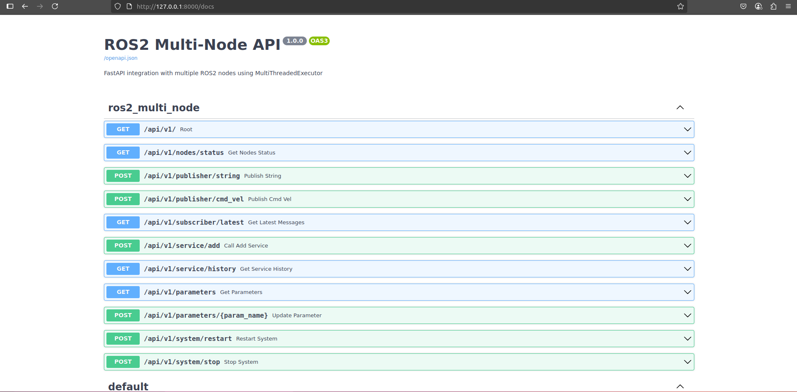

# ROS2 Multi-Node FastAPI Integration




## Project Structure

```
project/
├── main.py                 # Main FastAPI application
├── ros2_multi_node.py      # Multi-node ROS2 implementation
├── models.py               # Pydantic models
├── requirements.txt        # Python dependencies
└── README.md              # This file
```

## Usage

### 1. Start the Server

```bash
# Terminal 1: Start the FastAPI server
python main.py
```

The server will start on `http://localhost:8000`

### 2. API Endpoints

#### System Status
- `GET /` - Root endpoint
- `GET /health` - Health check
- `GET /api/v1/nodes/status` - Get all nodes status

#### Publisher Node
- `POST /api/v1/publisher/string` - Publish string message
- `POST /api/v1/publisher/cmd_vel` - Publish velocity command

#### Subscriber Node  
- `GET /api/v1/subscriber/latest` - Get latest received messages

#### Service Node
- `POST /api/v1/service/add` - Call add service
- `GET /api/v1/service/history` - Get service call history

#### Parameter Node
- `GET /api/v1/parameters` - Get all parameters
- `POST /api/v1/parameters/{param_name}` - Update parameter

#### System Control
- `POST /api/v1/system/restart` - Restart all nodes
- `POST /api/v1/system/stop` - Stop all nodes

### 3. Example Usage

#### Using curl:

```bash
# Check system health
curl http://localhost:8000/health

# Publish a string message
curl -X POST "http://localhost:8000/api/v1/publisher/string" \
     -H "Content-Type: application/json" \
     -d '{"message": "Hello from API!"}'

# Publish velocity command
curl -X POST "http://localhost:8000/api/v1/publisher/cmd_vel" \
     -H "Content-Type: application/json" \
     -d '{"linear_x": 1.0, "angular_z": 0.5}'

# Get latest messages
curl http://localhost:8000/api/v1/subscriber/latest?count=5

# Call service
curl -X POST "http://localhost:8000/api/v1/service/add" \
     -H "Content-Type: application/json" \
     -d '{"a": 10, "b": 20}'

# Get parameters
curl http://localhost:8000/api/v1/parameters

# Update parameter
curl -X POST "http://localhost:8000/api/v1/parameters/robot_name" \
     -H "Content-Type: application/json" \
     -d '{"value": "my_robot"}'
```

#### Using Python requests:

```python
import requests
import json

base_url = "http://localhost:8000/api/v1"

# Publish message
response = requests.post(
    f"{base_url}/publisher/string",
    json={"message": "Hello from Python!"}
)
print(response.json())

# Get latest messages
response = requests.get(f"{base_url}/subscriber/latest?count=3")
print(response.json())

# Call service
response = requests.post(
    f"{base_url}/service/add",
    json={"a": 15, "b": 25}
)
print(response.json())
```

### 4. ROS2 Command Line Integration

You can also interact with the nodes using standard ROS2 tools:

```bash
# List topics
ros2 topic list

# Echo messages
ros2 topic echo /chatter
ros2 topic echo /cmd_vel

# Publish from command line
ros2 topic pub /chatter std_msgs/msg/String "data: 'Hello from CLI'"

# List nodes
ros2 node list

# Get node info
ros2 node info /publisher_node
ros2 node info /subscriber_node

# List parameters
ros2 param list /parameter_node

# Get parameter value
ros2 param get /parameter_node robot_name

# Set parameter value
ros2 param set /parameter_node max_speed 2.0
```

## Features

### Multi-Node Architecture
- **PublisherNode**: Publishes string messages and velocity commands
- **SubscriberNode**: Receives and stores messages from various topics
- **ServiceNode**: Handles service calls and maintains call history
- **ParameterNode**: Manages node parameters dynamically

### MultiThreadedExecutor
- All nodes run concurrently using ROS2's MultiThreadedExecutor
- Each node uses ReentrantCallbackGroup for thread safety
- Non-blocking API operations

### Robust Error Handling
- Proper initialization and cleanup
- HTTP error responses with detailed messages
- Graceful shutdown handling

### Real-time Monitoring
- Live message monitoring
- Service call history
- Parameter tracking
- Node status reporting

## Advanced Usage

### Custom Node Addition

To add a new node type:

```python
class MyCustomNode(Node):
    def __init__(self, node_name: str = "custom_node"):
        super().__init__(node_name)
        self.callback_group = ReentrantCallbackGroup()
        # Add your publishers, subscribers, services, etc.

# Add to NodeManager.create_nodes()
self.nodes['custom'] = MyCustomNode()

# Add API endpoints
@api_router.get("/custom/status")
async def get_custom_status(manager: NodeManager = Depends(get_node_manager)):
    custom_node = manager.get_node('custom')
    return {"status": "custom node data"}
```

### Docker Deployment

```dockerfile
FROM ros:humble

WORKDIR /app
COPY . .
RUN pip install -r requirements.txt

EXPOSE 8000
CMD ["python", "ros2_fastapi.py"]
```

## Troubleshooting

1. **ROS2 not found**: Ensure ROS2 is installed and sourced
2. **Permission errors**: Check ROS2 environment variables
3. **Port conflicts**: Change port in main.py if 8000 is busy
4. **Node startup issues**: Check logs for initialization errors

For more help, check the FastAPI automatic documentation at `http://localhost:8000/docs`
